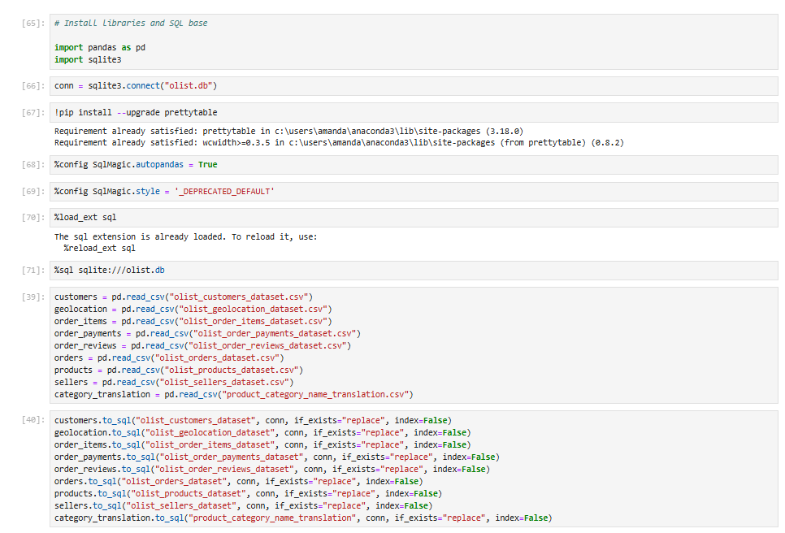
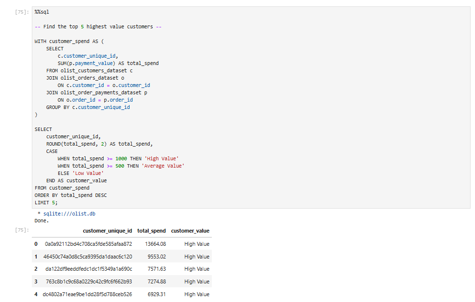
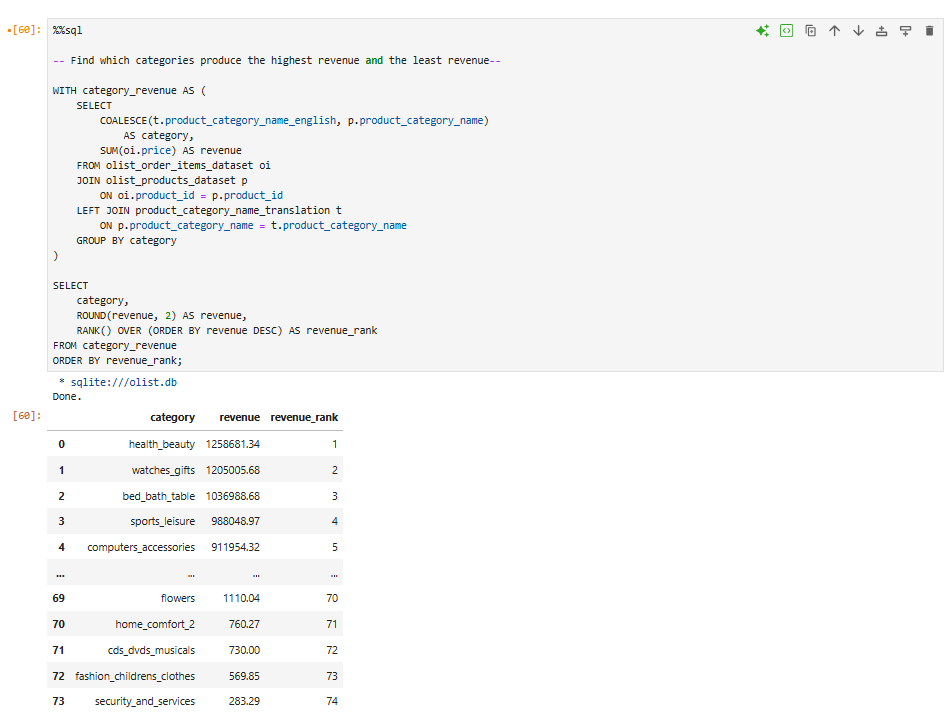

  
  
# Brazilian E-Commerce_Dataset  
#### SQL project that demonstrates exploratory data analysis using Brazilian E-Commerce data.

## Contents   
- [Purpose](#purpose)  
- [Objectives](#objectives)  
- [Skills](#skills)  
- [Conclusion](#conclusion)  
- [Actionable Insights](#actionable-insights)  
- [Previews](#previews)   
- [Final Project](#final-project)  
  
## Purpose

I created this project to demonstrate my SQL skills by using them to explore and analyse a Brazilian E-Commerce Dataset. The analysis focuses on exploratory data analysis (EDA) and uses SQL to investigate revenue, sales performance, customer behaviour, product categories, sellers, delivery performance and customer satisfaction.  
  
The analysis also focuses on identifying factors that contribute to revenue and areas where the business could investigate opportunities for improvement.  
  
## Objectives

- Perform exploratory data analysis (EDA) using SQL.  
- Analyse overall revenue and average order value.  
- Investigate how revenue changes over time.  
- Calculate month-over-month revenue growth.  
- Identify the product categories that generate the most revenue.  
- Analyse customer spending and identify high-value customers.  
- Create customer segments based on total customer spend.
- Investigate the relationship between delivery performance and customer reviews.
- Identify high-performing sellers based on revenue and order volume.
- Use SQL joins to combine data from multiple tables.
- Use CTEs, CASE statements and window functions to support analysis.
- Draw conclusions and potential recommendations from the results.  

## Skills

- SELECT
- COUNT()
- COUNT(DISTINCT)
- SUM()
- AVG()
- MIN()
- MAX()
- ROUND()
- COALESCE()
- CASE / WHEN / ELSE
- WITH / CTEs
- Subqueries
- INNER JOIN
- LEFT JOIN
- GROUP BY
- ORDER BY
- LIMIT
- STRFTIME()
- JULIANDAY()
- RANK() OVER()
- Date arithmetic
- Conditional filtering with WHERE  
   

- Interpreting analytical results
- Identifying trends and patterns
- Investigating business questions
- Communicating insights and recommendations
- Translating data findings into business-focused conclusions

## Conclusion

- Analysed 99,441 orders between September 2016 and October 2018, generating R$16.01M in total revenue with an average order value of R$160.99.  

- 96,478 orders were delivered, showing a high overall delivery completion rate, while cancellations, unavailable orders, and other incomplete statuses represented a smaller proportion of orders.  

- Revenue generally increased throughout 2017 and 2018, with November 2017 generating the highest monthly revenue at approximately R$1.19M.  

- September and October 2018 should not be interpreted as genuine revenue declines, as the dataset ends on 17 October 2018, making both months incomplete.  

- Health & Beauty, Watches & Gifts, and Bed Bath Table were the three highest-revenue product categories, indicating strong demand in these areas.  

- Credit cards were the dominant payment method, generating approximately R$12.54M in revenue and accounting for the majority of transactions.  

- Customer analysis identified high-value customers, with the highest-spending customer generating R$13,664.08 in total spend.  

- Customer satisfaction was strongly associated with delivery performance: 1-star reviews averaged 21.31 days for delivery, compared with 10.69 days for 5-star reviews.  

- Overall delivery time averaged 12.56 days, but the maximum recorded delivery time was 209.63 days, highlighting potential extreme delivery issues.  

## Actionable Insights

- Improve delivery performance by investigating sellers, regions and logistics processes associated with longer delivery times.  
  
- Prioritise high-value customer retention through loyalty programmes, personalised offers and targeted marketing.  
  
- Invest in high-performing categories such as Health & Beauty, Watches & Gifts, and Bed Bath Table through inventory planning and marketing.  
  
- Investigate low-performing categories before discontinuing them to determine whether low revenue is caused by demand, pricing, availability or limited marketing.  
  
- Monitor cancelled, unavailable and delayed orders to identify operational problems and potential lost revenue.  
  
- Optimise the credit-card checkout experience, given its dominant share of transactions and revenue.  
  
- Use complete months when comparing revenue trends and clearly flag partial periods to avoid misleading conclusions.    

- Overall, the analysis suggests that delivery reliability, customer retention and investment in high-performing product categories are the strongest opportunities for improving e-commerce performance.    
  
## Previews

 

 

 

## Final Project

**[Go to Final Project](Final_Project/braziecomdata.ipynb)**

###### Dataset: [Kaggle](https://www.kaggle.com/datasets/olistbr/brazilian-ecommerce)

###### Dataset downloaded originally cleaned

###### Plan to create a dashboard for the data with Power BI or Tableau in the future
